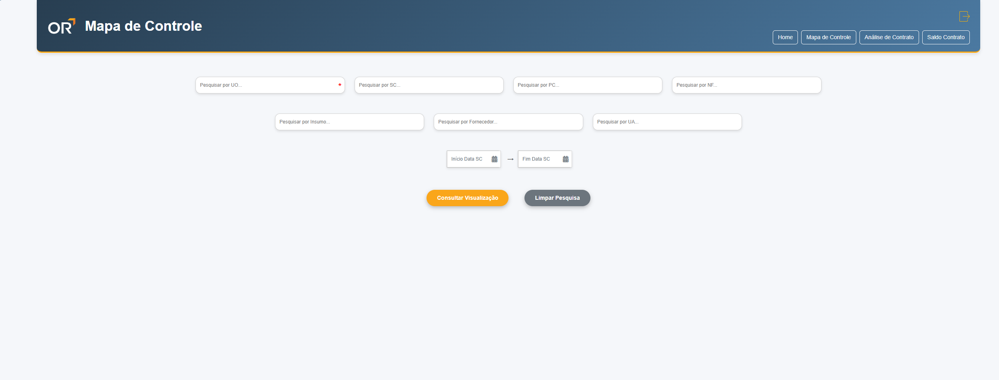

# Relatórios de Sistema Financeiro

Dashboard profissional desenvolvido em Python com Dash, voltado à gestão e análise de dados financeiros extraídos de um Sistema Corporativo. A aplicação permite filtragem avançada, visualização tabular e exportação para Excel com base nos dados da view `vw_financeiro_obra`.

---


---

## 🔧 Funcionalidades

- 🔐 **Autenticação via LDAP** com controle de sessão e timeout automático  
- 📄 **Consulta por filtros**: SC, PC, NF, UO, Insumo, Fornecedor e UA  
- 📊 **Exibição tabular interativa** com paginação e responsividade  
- 📤 **Exportação para Excel** com formatação automática  
- 💡 **Interface moderna** com responsividade e animações CSS personalizadas  

---



---

## 🧠 Módulos Disponíveis

- `Mapa de Controle` — Visualização completa dos lançamentos de todas as faturas de compras de materiais destinadas às obras. Permite consultas por diversos campos como SC, PC, NF, insumo, fornecedor, entre outros.
- `Análise de Contrato` — (em desenvolvimento) Módulo voltado à análise detalhada (analítica) dos contratos e dos lançamentos financeiros associados aos fornecedores.
- `Saldo de Contrato` — (em desenvolvimento) Módulo com foco em fornecer uma visão consolidada e simplificada dos contratos firmados, sem detalhamentos técnicos.

---

## 📌 Explicação dos Filtros do Mapa de Controle

Cada campo de pesquisa na tela do *Mapa de Controle* permite ao usuário refinar os dados com precisão. Abaixo, seguem as siglas utilizadas:

- 🔎 **Pesquisar por SC** — *Solicitação de Compra*: permite pesquisar as solicitações de materiais feitas para as obras.  
- 🔎 **Pesquisar por PC** — *Pedido de Compra*: pesquisa os pedidos formalizados a fornecedores.  
- 🔎 **Pesquisar por NF** — *Nota Fiscal*: busca por documentos fiscais relacionados às entregas.  
- 🏗️ **Pesquisar por UO** — *Unidade Organizacional*: cada unidade representa um empreendimento da empresa.  
- 🧱 **Pesquisar por Insumo** — permite filtrar por tipo de material solicitado ou adquirido.  
- 🧾 **Pesquisar por Fornecedor** — busca pelos parceiros comerciais que forneceram os produtos ou serviços.  
- 💼 **Pesquisar por UA** — *Unidade Analítica*: refere-se ao centro de custo ou unidade contábil utilizada internamente.  

Esses filtros foram desenvolvidos para proporcionar **flexibilidade e agilidade** na análise dos dados financeiros da operação.

---

## 🗂️ Estrutura do Projeto

```text
📦 vw_financeiro_obra
├── app.py
├── layout_inicial.py
├── callbacks_inicial.py
├── request.py
├── ldap_auth.py
├── menu_mapa_controle/
│   ├── layout.py
│   └── callbacks.py
├── assets/
│   ├── styles.css
│   ├── -- outros arquivos (logo, imagem) png
│   └── images/
│       ├── img_1.png
│       └── img_2.png
├── shared_data/
│   ├── vw_financeiro_obra.csv
│   └── log_historico_acesso.csv
```
---

## ⚙️ Tecnologias Utilizadas
A aplicação foi desenvolvida com Python e conta com as seguintes bibliotecas:

📊 Dash — Framework para criação de dashboards interativos em Python
💠 Dash Bootstrap Components — Componentes visuais baseados no Bootstrap
📈 Pandas — Manipulação e análise de dados
🛠️ SQLAlchemy — ORM para conexão com banco de dados
🧩 oracledb — Driver Oracle para conexão nativa com banco de dados
🔒 ldap3 — Integração com serviços de diretório LDAP
📤 XlsxWriter — Exportação de planilhas Excel com formatação
⚙️ python-dotenv — Gerenciamento de variáveis de ambiente com .env

---

## 🏁 Como Executar Localmente
Siga os passos abaixo para rodar o projeto em ambiente local:

1. Clone o repositório

- git clone https://github.com/paesdj1987/vw_financeiro_obra.git
- cd vw_financeiro_obra

2. Instale as dependências

- pip install -r requirements.txt
- Configure as variáveis de ambiente

3. Crie um arquivo .env com as seguintes variáveis:

- FLASK_SECRET=...
- LDAP_SERVER=...
- LDAP_BIND_DN=...
- LDAP_BIND_PASSWORD=...
- LDAP_BASE_DN=...

4. Execute o projeto

- python app.py

---

## 👤 Autor
Desenvolvido por João Paes
🔗 github.com/paesdj1987